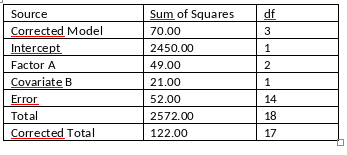

```{r, echo = FALSE, results = "hide"}
include_supplement("vufgb-anovaftest-008-nl-table01.jpg", recursive = TRUE)
```

Question
========

Given is the following SPSS output from an ANCOVA model.  Indicate between which values is the F value associated with the test for Factor A and whether or not the effect is significant.


  
Answerlist
----------
* (6.5, 10); significant
* (4, 6.5); not significant
* (4, 6.5); significant
* (6.5, 10); not significant


Solution
========

Answerlist
----------
* Correct
* Incorrect
* Incorrect
* Incorrect

Meta-information
================
exname: vufgb-anovaftest-008-en
extype: schoice
exsolution: 1000
exsection: Inferential Statistics/Parametric Techniques/ANOVA/ANOVA F-test, Inferential Statistics/Parametric Techniques/ANOVA/ANCOVA
exextra[ID]: 3f6ca
exextra[Type]: Interpreting output, Calculation
exextra[Program]: SPSS
exextra[Language]: English
exextra[Level]: Statistical Thinking
