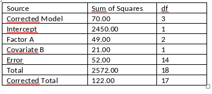

```{r, echo = FALSE, results = "hide"}
include_supplement("vufgb-anovaftest-008-nl-table01.jpg", recursive = TRUE)
```

Question
========

Gegeven is de volgende SPSS-output van een ANCOVA-model.  Geef aan tussen welke waarden de F-waarde ligt die hoort bij de toets voor Factor A en of het effect al dan niet significant is.


  
Answerlist
----------
* (6.5, 10); wel significant
* (4, 6.5); niet significant
* (4, 6.5); wel significant
* (6.5, 10); niet significant


Solution
========

Answerlist
----------
* Correct
* Incorrect
* Incorrect
* Incorrect

Meta-information
================
exname: vufgb-anovaftest-008-nl
extype: schoice
exsolution: 1000
exsection: Inferential Statistics/Parametric Techniques/ANOVA/ANOVA F-test, Inferential Statistics/Parametric Techniques/ANOVA/ANCOVA
exextra[Type]: Interpretating output, Calculation
exextra[Program]: SPSS
exextra[Language]: Dutch
exextra[Level]: Statistical Thinking