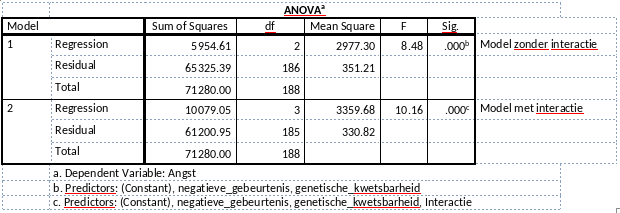

```{r, echo = FALSE, results = "hide"}
include_supplement("vufgb-anovaftest-009-nl-table01.jpg", recursive = TRUE)
```

Question
========
A researcher is interested in the influence of negative events and genetic vulnerability on anxiety symptoms. He calculates two regression models. Once with the main effects only, and once with the main effects and the interaction effect. Look at the tables below and calculate the F-value ("Model Comparison Test") for the model comparison of the model without interaction and the model with interaction.


  
Answerlist
----------
* 10.16
* 8.48
* 1.68
* 12.47

Solution
========

Answerlist
----------
* Incorrect
* Incorrect
* Incorrect
* Correct

Meta-information
================
exname: vufgb-anovaftest-009-en
extype: schoice
exsolution: 0001
exsection: Inferential Statistics/Parametric Techniques/ANOVA/ANOVA F-test, Inferential Statistics/Regression/Regression F-test, Descriptive statistics/Data representation/Tables
exextra[Type]: Interpreting output, Calculation
exextra[Program]: 
exextra[Language]: English
exextra[Level]: Statistical Thinking
