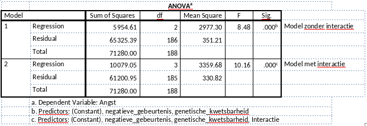

```{r, echo = FALSE, results = "hide"}
include_supplement("vufgb-anovaftest-009-nl-table01.jpg", recursive = TRUE)
```

Question
========
Een onderzoeker is geïnteresseerd in de invloed van negatieve gebeurtenissen en genetische kwetsbaarheid op angstsymptomen. Hij berekent twee regressiemodellen. Een keer alleen met de hoofdeffecten, en een keer met de hoofdeffecten en het interactie-effect. Kijk naar onderstaande tabellen en bereken de F-waarde (‘Model Comparison Test’) voor de modelvergelijking van het model zonder interactie en het model met interactie.


  
Answerlist
----------
* 10.16
* 8.48
* 1.68
* 12.47

Solution
========

Answerlist
----------
* Incorrect
* Incorrect
* Incorrect
* Correct

Meta-information
================
exname: vufgb-anovaftest-009-nl
extype: schoice
exsolution: 0001
exsection: Inferential Statistics/Parametric Techniques/ANOVA/ANOVA F-test, Inferential Statistics/Regression/Regression F-test, Descriptive statistics/Data representation/Tables
exextra[Type]: Interpreting output, Calculation
exextra[Program]: 
exextra[Language]: Dutch
exextra[Level]: Statistical Thinking
