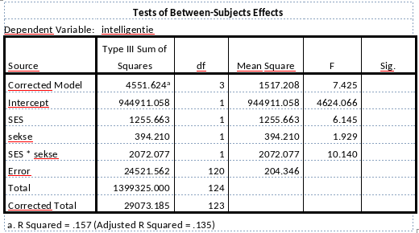

```{r, echo = FALSE, results = "hide"}
include_supplement("vufgb-anovaftest-011-nl-table01.jpg", recursive = TRUE)
```

Question
========

A researcher is interested in the effect of gender (0=boy,1=girl) and socioeconomic status (SES; 0=low, 1=middle/high) on intelligence. She analyzes her data using a Two-Way ANOVA with interaction in the General Linear Model module in SPSS. Look at the table below. What conclusion can you draw regarding the interaction between gender and SES on intelligence? Complete. The F value is ... than the critical value, so there is ... there is a significant interaction effect.


  
Answerlist
----------
* Smaller; none
* Larger; none
* Smaller; yes
* Larger; well


Solution
========

Answerlist
----------
* Incorrect
* Incorrect
* Incorrect
* Correct

Meta-information
================
exname: vufgb-anovaftest-011-en
extype: schoice
exsolution: 0001
exsection: Inferential Statistics/Parametric Techniques/ANOVA/ANOVA F-test, Descriptive statistics/Data representation/Tables
exextra[ID]: 6ef1c
exextra[Type]: Conceptual, Interpreting output
exextra[Program]: SPSS
exextra[Language]: English
exextra[Level]: Statistical Thinking
