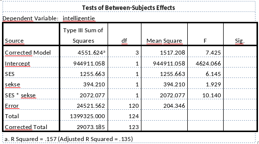

```{r, echo = FALSE, results = "hide"}
include_supplement("vufgb-anovaftest-011-nl-table01.jpg", recursive = TRUE)
```

Question
========

Een onderzoeker is geïnteresseerd in het effect van sekse (0=jongen,1=meisje) en socio-economische status (SES; 0=laag, 1=midden/hoog) op intelligentie. Zij analyseert haar data middels een ANOVA met twee Factoren (‘Two-Way ANOVA’) met interactie in de General Linear Model module in SPSS. Kijk naar onderstaande tabel. Welke conclusie kun je trekken met betrekking tot de interactie tussen sekse en SES op intelligentie? Vul aan. De F-waarde is ... dan de kritieke waarde, dus is er ... sprake van een significant interactie-effect.


  
Answerlist
----------
* kleiner; geen 
* groter; geen 
* kleiner; wel
* groter; wel


Solution
========

Answerlist
----------
* Incorrect
* Incorrect
* Incorrect
* Correct

Meta-information
================
exname: vufgb-anovaftest-011-nl
extype: schoice
exsolution: 0001
exsection: Inferential Statistics/Parametric Techniques/ANOVA/ANOVA F-test, Descriptive statistics/Data representation/Tables
exextra[Type]: Conceptual, Interpreting output
exextra[Program]: SPSS
exextra[Language]: Dutch
exextra[Level]: Statistical Thinking