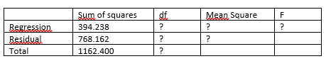

```{r, echo = FALSE, results = "hide"}
include_supplement("vufgb-anovaftest-012-nl-table01.jpg", recursive = TRUE)
```

Question
========
Given is the incomplete ANOVA table below belonging to a multiple regression model with two predictors conducted in a sample of 40 individuals. Calculate the *F* value.


  
Answerlist
----------
* 6.43
* 6.60
* 9.50
* 9.75


Solution
========

Answerlist
----------
* Incorrect
* Incorrect
* Correct
* Incorrect

Meta-information
================
exname: vufgb-anovaftest-012-en
extype: schoice
exsolution: 0010
exsection: Inferential Statistics/Parametric Techniques/ANOVA/ANOVA F-test
exextra[ID]: d2403
exextra[Type]: Interpreting output, Calculation
exextra[Program]: 
exextra[Language]: English
exextra[Level]: Statistical Thinking
