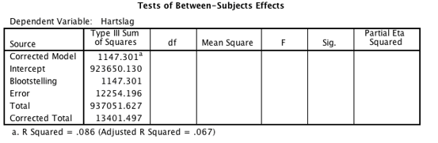

```{r, echo = FALSE, results = "hide"}
include_supplement("vufgb-anovaftest-013-nl-table01.jpg", recursive = TRUE)
```

Question
========

An experiment examines the effect of exposure to stress (two conditions: 1=well exposed; 0=not exposed) on heart rate in a sample of 50 students. The relationship between Exposure to stress and Heart Rate is examined by means of a One-Way ANOVA in the General Linear Model module in SPSS. Given is the incomplete ANOVA table below. Calculate the F-value associated with the test for the effect of Exposure.


  
Answerlist
----------
* 4.49
* 2.25
* 0.22
* 0.09


Solution
========

Answerlist
----------
* Correct
* Incorrect
* Incorrect
* Incorrect

Meta-information
================
exname: vufgb-anovaftest-013-en
extype: schoice
exsolution: 1000
exsection: Inferential Statistics/Parametric Techniques/ANOVA/ANOVA F-test
exextra[Type]: Interpreting output, Calculation
exextra[Program]: SPSS
exextra[Language]: English
exextra[Level]: Statistical Thinking
