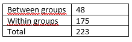

```{r, echo = FALSE, results = "hide"}
include_supplement("vufgb-anovaftest-014-nl-table01.jpg", recursive = TRUE)
```

Question
========

A clinical psychologist compares stress symptoms between three groups (control, cognitive therapy, psychoanalytic therapy) in 60 subjects using a one-factor ANOVA ("One-way ANOVA").

Below is a table of sum of squares ('Sum of Squares'). Calculate the *F* value.


  
Answerlist
----------
* 3.65
* 7.82
* 7.95
* 0.27


Solution
========

Answerlist
----------
* Incorrect
* Correct
* Incorrect
* Incorrect

Meta-information
================
exname: vufgb-anovaftest-014-en
extype: schoice
exsolution: 0100
exsection: Inferential Statistics/Parametric Techniques/ANOVA/ANOVA F-test
exextra[ID]: b0286
exextra[Type]: Interpreting output, Calculation
exextra[Program]: 
exextra[Language]: English
exextra[Level]: Statistical Thinking
