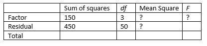

```{r, echo = FALSE, results = "hide"}
include_supplement("vufgb-anovaftest-017-nl-table01.jpg", recursive = TRUE)
```

Question
========

Complete the table below with results from a one-way ANOVA. TRUE is the *F* value, and what does it mean?


  
Answerlist
----------
* *F* = 5.56, the variance between groups is greater than the variance within groups.
* * *F* = 0.18, the variance between groups is smaller than the variance within groups.
* *F* = 5.56, the variance within groups is greater than the variance between groups.
* *F* = 0.18, the variance within groups is smaller than the variance between groups.

Solution
========

Answerlist
----------
* Correct
* Incorrect
* Incorrect
* Incorrect

Meta-information
================
exname: vufgb-anovaftest-017-en
extype: schoice
exsolution: 1000
exsection: Inferential Statistics/Parametric Techniques/ANOVA/ANOVA F-test
exextra[Type]: Interpreting output
exextra[Program]: 
exextra[Language]: English
exextra[Level]: Statistical Literacy
