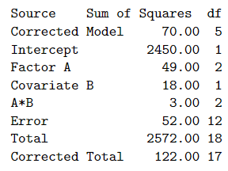

```{r, echo = FALSE, results = "hide"}
include_supplement("vufgb-anovaftest-018-nl-table01.jpg", recursive = TRUE)
```

Question
========

Given is the following ANOVA table of an ANCOVA model with interaction. Indicate between which values lies the F-value associated with the test for the interaction effect and whether or not the interaction effect is significant.


  
Answerlist
----------
* (0, 1), not significant
* (0, 1), significant
* (1, 3), not significant
* (1, 3), significant

Solution
========

Answerlist
----------
* Correct
* Incorrect
* Incorrect
* Incorrect

Meta-information
================
exname: vufgb-anovaftest-018-en
extype: schoice
exsolution: 1000
exsection: Inferential Statistics/Parametric Techniques/ANOVA/ANOVA F-test
exextra[Type]: Calculation, Interpreting output
exextra[Program]: 
exextra[Language]: English
exextra[Level]: Statistical Literacy
