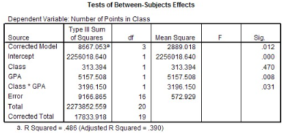

```{r, echo = FALSE, results = "hide"}
include_supplement("vufgb-anovaftest-019-nl-table01.jpg", recursive = TRUE)
```

Question
========

A researcher conducted a Factorial ANOVA to examine whether the correlation between GPA (Grade Point Average) scores and peer classes (class) is related to the number of points they receive from the teacher for class participation (nr of points in class).

Calculate the F-value associated with "Class."


  
Answerlist
----------
* 9.002
* 0.547
* 0.034
* 1.828

Solution
========

Answerlist
----------
* Incorrect
* Correct
* Incorrect
* Incorrect

Meta-information
================
exname: vufgb-anovaftest-019-en
extype: schoice
exsolution: 0100
exsection: Inferential Statistics/Parametric Techniques/ANOVA/ANOVA F-test
exextra[ID]: 82024
exextra[Type]: Interpreting output, Calculation
exextra[Program]: SPSS
exextra[Language]: English
exextra[Level]: Statistical Literacy
