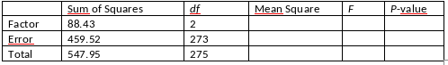

```{r, echo = FALSE, results = "hide"}
include_supplement("vufgb-anovaftest-021-nl-table01.jpg", recursive = TRUE)
```

Question
========

Given is the table below with results of a one-way ANOVA ("one-way ANOVA").

Calculate the *F* value for the effect of Factor.


  
Answerlist
----------
* 44.22
* 26.27
* 22.19
* 5.20

Solution
========

Answerlist
----------
* Incorrect
* Correct
* Incorrect
* Incorrect

Meta-information
================
exname: vufgb-anovaftest-021-en
extype: schoice
exsolution: 0100
exsection: Inferential Statistics/Parametric Techniques/ANOVA/ANOVA F-test
exextra[ID]: 4568e
exextra[Type]: Calculation, Interpreting output
exextra[Program]: 
exextra[Language]: English
exextra[Level]: Statistical Literacy
