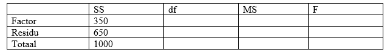

```{r, echo = FALSE, results = "hide"}
include_supplement("vufgb-anovaftest-023-nl-table01.jpg", recursive = TRUE)
```

Question
========

An occupational and organizational psychologist compares the degree of risk behavior among managers working in three types of organizations: government agencies (OV), non-listed companies (NB) and publicly traded companies (BB). A total of 75 managers are participating. Below is the incomplete table with data resulting from an Oneway ANOVA with Type of Organization as Factor and Risk Behavior as dependent variable.

Calculate the *F* value.


  
Answerlist
----------
* 0.02
* 0.54
* 13.46
* 19.38

Solution
========

$Df_{1} = g-1 = 3-1 = 2$; $MS_{factor} = \frac{SS}{df_{1}} = \frac{350}{2} = 175$.

$Df_{2} = N-g = 75-3 = 72$; $MS_{residu} = \frac{SS}{df_{2}} = \frac(650}{72} = 9.03$.

$F = \frac{MS_{factor}}{MS_{residu}} = \frac{175}{9.03} = 19.38$.

Answerlist
----------
* Incorrect
* Incorrect
* Incorrect
* Correct

Meta-information
================
exname: vufgb-anovaftest-023-en
extype: schoice
exsolution: 0001
exsection: Inferential Statistics/Parametric Techniques/ANOVA/ANOVA F-test
exextra[ID]: e9d9a
exextra[Type]: Calculation, Interpreting output
exextra[Program]: 
exextra[Language]: English
exextra[Level]: Statistical Thinking
