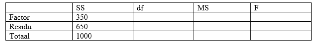

```{r, echo = FALSE, results = "hide"}
include_supplement("vufgb-anovaftest-023-nl-table01.jpg", recursive = TRUE)
```

Question
========

Een arbeids- en organisatiepsycholoog vergelijkt de mate van risicogedrag bij managers werkzaam bij drie typen organisaties: overheidsinstellingen (OV), niet-beursgenoteerde bedrijven (NB) en beursgenoteerde bedrijven (BB). In totaal doen 75 managers mee. Hieronder staat de incomplete tabel met gegevens die het resultaat zijn van een Oneway ANOVA met Type organisatie als Factor en risicogedrag als afhankelijke variabele.

Bereken de *F*-waarde.


  
Answerlist
----------
* 0.02
* 0.54
* 13.46
* 19.38

Solution
========

$Df_{1} = g-1 = 3-1 = 2$; $MS_{factor} = \frac{SS}{df_{1}} = \frac{350}{2} = 175$.

$Df_{2} = N-g = 75-3 = 72$; $MS_{residu} = \frac{SS}{df_{2}} = \frac(650}{72} = 9.03$.

$F = \frac{MS_{factor}}{MS_{residu}} = \frac{175}{9.03} = 19.38$.

Answerlist
----------
* Incorrect
* Incorrect
* Incorrect
* Correct

Meta-information
================
exname: vufgb-anovaftest-023-nl
extype: schoice
exsolution: 0001
exsection: Inferential Statistics/Parametric Techniques/ANOVA/ANOVA F-test
exextra[Type]: Calculation, Interpreting output
exextra[Program]: 
exextra[Language]: Dutch
exextra[Level]: Statistical Thinking
