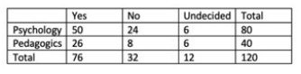

```{r, echo = FALSE, results = "hide"}
include_supplement("vufgb-chisquared-003-en-table01.jpg", recursive = TRUE)
```

Question
========
  
In a study about future life plans, 80 psychology and 40 pedagogics students were asked whether they want to have children in the future. The
choices available to each person were "Yes", "No" and "Undecided". Listed below are the results of the survey. Determine the Chi-square test
statistic to test independence and the corresponding degrees of freedom.



Answerlist
----------
* $\chi^{2} = 2.53$, with 2 degrees of freedom
* $\chi^{2} = 3.65$, with 2 degrees of freedom
* $\chi^{2} = 2.53$, with 6 degrees of freedom
* $\chi^{2} = 3.65$, with 6 degrees of freedom

  
Solution
========
  
Answerlist
----------
* Correct
* Incorrect
* Incorrect
* Incorrect

Meta-information
================
exname: vufgb-chisquared-003-en
extype: schoice
exsolution: 1000
exsection: Inferential Statistics/NHST/Test statistic/Chi-squared
exextra[Type]: Calculation
exextra[Program]: 
exextra[Language]: English
exextra[Level]: Statistical Thinking
