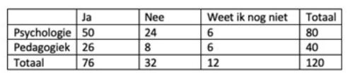

```{r, echo = FALSE, results = "hide"}
include_supplement("vufgb-chisquared-003-nl-table01.jpg", recursive = TRUE)
```

Question
========
  
In een onderzoek naar toekomstige levensplannen zijn 80 psychologie en 40 pedagogiek studenten
gevraagd of zij later kinderen willen. Personen konden “Ja”, “Nee” of “Weet ik nog niet” antwoorden.
In onderstaande tabel staan de resultaten. Bepaal de Chi-kwadraat toetsstatistiek die bij deze
steekproef hoort en het aantal vrijheidsgraden (***degrees of freedom***) van de bijbehorende verdeling.


  
Answerlist
----------
* $\chi^{2} = 2.53$, met 2 vrijheidsgraden
* $\chi^{2} = 3.65$, met 2 vrijheidsgraden
* $\chi^{2} = 2.53$, met 6 vrijheidsgraden
* $\chi^{2} = 3.65$, met 6 vrijheidsgraden

Solution
========

Answerlist
----------
* Correct
* Incorrect
* Incorrect
* Incorrect

Meta-information
================
exname: vufgb-chisquared-003-nl
extype: schoice
exsolution: 1000
exsection: Inferential Statistics/NHST/Test statistic/Chi-squared
exextra[Type]: Calculation
exextra[Program]: 
exextra[Language]: Dutch
exextra[Level]: Statistical Thinking