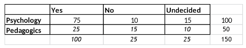

```{r, echo = FALSE, results = "hide"}
include_supplement("vufgb-chisquared-005-en-table01.jpg", recursive = TRUE)
```

Question
========
  
In a study about future life plans,100 psychology students and 50 pedagogics students 
were asked whether they were considering pursuing a Master's program after they 
finish their Bachelor's. The choices available to each person were "Yes", "No" and 
"Undecided". Listed below are the results of the survey. Determine the Chi-square 
test statistic to test independence and the corresponding degrees of freedom.





Answerlist
----------
* $\chi^{2} = 3.71$, with 6 degrees of freedom
* $\chi^{2} = 11.63$,  with 6 degrees of freedom
* $\chi^{2} = 3.71$,  with 2 degrees of freedom
* $\chi^{2} = 11.63$,  with 2 degrees of freedom


Solution
========
  
Answerlist
----------
* Incorrect
* Incorrect
* Incorrect
* Correct

Meta-information
================
exname: vufgb-chisquared-005-en
extype: schoice
exsolution: 0001
exsection: Inferential Statistics/NHST/Test statistic/Chi-squared
exextra[Type]: Calculation
exextra[Program]: 
exextra[Language]: English
exextra[Level]: Statistical Thinking
