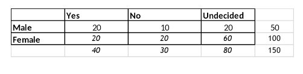

```{r, echo = FALSE, results = "hide"}
include_supplement("vufgb-chisquared-007-en-table01.jpg", recursive = TRUE)
```

Question
========
  
In a research study about the association between gender and whether they personally wanted to have kids, 50 male students and 100 female students were surveyed. The choices available to each person were "Yes," "No," and "Undecided." Listed below are the results of the survey. Determine the Chi-square test statistic to test independence and the corresponding degrees of freedom. 


  
Answerlist
----------
* $\chi^{2} = 3.33$, with 5 degrees of freedom.
* $\chi^{2} = 7.50$,  with 5 degrees of freedom.
* $\chi^{2} = 3.33$,  with 2 degrees of freedom.
* $\chi^{2} = 7.50$,  with 2 degrees of freedom.


Solution
========

Answerlist
----------
* Incorrect
* Incorrect
* Incorrect
* Correct

Meta-information
================
exname: vufgb-chisquared-007-en
extype: schoice
exsolution: 0001
exsection: Inferential Statistics/NHST/Test statistic/Chi-squared, Descriptive statistics/Data representation/Tables
exextra[Type]: Calculation
exextra[Program]: 
exextra[Language]: English
exextra[Level]: Statistical Thinking