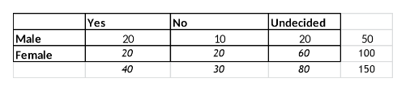

```{r, echo = FALSE, results = "hide"}
include_supplement("vufgb-chisquared-007-nl-table01.jpg", recursive = TRUE)
```

Question
========
  
In een onderzoek naar de samenhang tussen geslacht en eventuele kinderwens is aan 50 mannelijke (*Male*) studenten en 100 vrouwelijke (***Female***) studenten gevraagd of zij later kinderen zouden willen hebben. Personen konden Ja (*Yes*), Nee (*No*) of Onbeslist (***Undecided***) antwoorden. In onderstaande tabel staan de resultaten. Bepaal de Chi-kwadraat toetsstatistiek die bij deze steekproef hoort en het aantal vrijheidsgraden (***degrees of freedom***) van de bijbehorende verdeling.


  
Answerlist
----------
* $\chi^{2} = 3.33$,  met 5 vrijheidsgraden
* $\chi^{2} = 7.50$,  met 5 vrijheidsgraden
* $\chi^{2} = 3.33$,  met 2 vrijheidsgraden
* $\chi^{2} = 7.50$,  met 2 vrijheidsgraden


Solution
========

Answerlist
----------
* Incorrect
* Incorrect
* Incorrect
* Correct

Meta-information
================
exname: vufgb-chisquared-007-nl
extype: schoice
exsolution: 0001
exsection: Inferential Statistics/NHST/Test statistic/Chi-squared, Descriptive statistics/Data representation/Tables
exextra[ID]: 50bb3
exextra[Type]: Calculation
exextra[Program]: 
exextra[Language]: Dutch
exextra[Level]: Statistical Thinking
