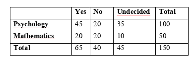

```{r, echo = FALSE, results = "hide"}
include_supplement("vufgb-chisquared-009-nl-table01.jpg", recursive = TRUE)
```

Question
========
  
In een onderzoek naar de samenhang tussen opleidingskeuze en maatschappelijke betrokkenheid is aan 100 psychologie studenten en 50 wiskunde studenten onder andere gevraagd of zij van plan zijn tijdens hun studie vrijwilligerswerk te verrichten. Personen konden “Ja”, “Nee” of “Weet ik nog niet” antwoorden. In onderstaande tabel staan de resultaten. Bepaal de Chi-kwadraat toetsstatistiek die bij deze steekproef hoort en het aantal vrijheidsgraden (degrees of freedom) van de bijbehorende verdeling.



  
Answerlist
----------
* $\chi^{2} = 1.73$,  met 6 vrijheidsgraden.
* $\chi^{2} = 7.69$,  met 6 vrijheidsgraden.
* $\chi^{2} = 1.73$,  met 2 vrijheidsgraden.
* $\chi^{2} = 7.69$,  met 2 vrijheidsgraden.


Solution
========

Answerlist
----------
* Incorrect
* Incorrect
* Incorrect
* Correct

Meta-information
================
exname: vufgb-chisquared-009-nl
extype: schoice
exsolution: 0001
exsection: Inferential Statistics/NHST/Test statistic/Chi-squared, Descriptive statistics/Data representation/Tables
exextra[ID]: a6289
exextra[Type]: Calculation
exextra[Program]: 
exextra[Language]: Dutch
exextra[Level]: Statistical Thinking
