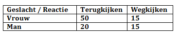

```{r, echo = FALSE, results = "hide"}
include_supplement("vufgb-chisquared-012-nl-table01.jpg", recursive = TRUE)
```

Question
========
  
Using a sample of 100 students, examine whether there is a correlation between response to eye contact ("looking back" or "looking away") and gender ("female" or "male"). Using the table below, calculate the Chi-squared test statistic and determine the number of degrees of freedom of the corresponding distribution.


  
Answerlist
----------
* $\chi^{2} = 4.24$, with 1 degree of freedom
* $\chi^{2} = 4.24$, with 2 degrees of freedom
* $\chi^{2} = 1.01$, with 1 degree of freedom
* $\chi^{2} = 1.01$, with 2 degrees of freedom

Solution
========

Answerlist
----------
* Correct
* Incorrect
* Incorrect
* Incorrect

Meta-information
================
exname: vufgb-chisquared-012-en
extype: schoice
exsolution: 1000
exsection: Inferential Statistics/NHST/Test statistic/Chi-squared, Descriptive statistics/Data representation/Tables
exextra[Type]: Calculation
exextra[Program]: 
exextra[Language]: English
exextra[Level]: Statistical Thinking
