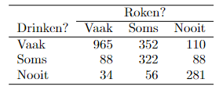

```{r, echo = FALSE, results = "hide"}
include_supplement("vufgb-chisquared-013-nl-table01.jpg", recursive = TRUE)
```

Question
========
A survey at a high school in Dayton, Ohio, yielded the following data



The test for independence gives the result $\chi^{2}$(4) = 1211.69, p < 0.001. Which cell absolutely has the largest standardized residue? 
Answerlist
----------
* The cell 'Drinking: Often, Smoking: Often'
* The cell 'Drinking: Sometimes, Smoking: Never'
* The cell 'Drinking: Never, Smoking: Often'
* The cell 'Drinking: Never, Smoking: Never'.

Solution
========

Answerlist
----------
* Correct
* Incorrect
* Incorrect
* Incorrect

Meta-information
================
exname: vufgb-chisquared-013-en
extype: schoice
exsolution: 1000
exsection: Inferential Statistics/NHST/Test statistic/Chi-squared, Descriptive statistics/Data representation/Tables
exextra[Type]: Conceptual
exextra[Program]: 
exextra[Language]: English
exextra[Level]: Statistical Literacy
