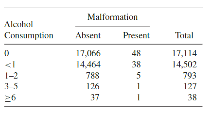

```{r, echo = FALSE, results = "hide"}
include_supplement("vufgb-chisquared-015-nl-table01.jpg", recursive = TRUE)
```

Question
========

Given is the following table obtained in a study (N = 32,574) of 'maternal drinking' and 'congenital malformations'.


  
The independence test provides a $\chi^{2}$-value of 12.08. Key with a $\alpha$ of 1% whether this outcome is statistically significant.  
  
Answerlist
----------
* The critical value is 11.3. Conclusion: do reject $H_{0}$.
* The critical value is 13.3. Conclusion: do reject $H_{0}$.
* The critical value is 11.3. Conclusion: do not reject $H_{0}$.
* The critical value is 13.3. Conclusion: do not reject $H_{0}$.

Solution
========

Answerlist
----------
* Incorrect
* Incorrect
* Incorrect
* Correct

Meta-information
================
exname: vufgb-chisquared-015-en
extype: schoice
exsolution: 0001
exsection: Inferential Statistics/NHST/Test statistic/Chi-squared, Inferential Statistics/NHST/Hypothesis/Null hypothesis
exextra[ID]: 1354f
exextra[Type]: Interpreting output, Conceptual
exextra[Program]: 
exextra[Language]: English
exextra[Level]: Statistical Thinking
