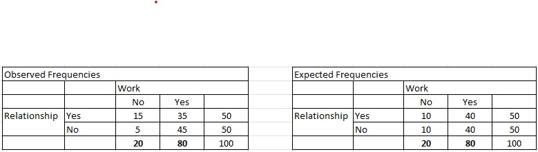

```{r, echo = FALSE, results = "hide"}
include_supplement("vufgb-chisquared-016-nl-table01.jpg", recursive = TRUE)
```

Question
========

A researcher wants to know if there is a relationship between relationship status and work status. The observed and expected frequencies are listed in the tables below. Calculate the $\chi^{2}$-value associated with the test for independence between these two categorical variables.

 
Answerlist
----------
* $\chi^{2}$ = 6.25
* $\chi^{2}$ = 1.25
* $\chi^{2}$ = 8.16
* $\chi^{2}$ = 2.44


Solution
========

Answerlist
----------
* Correct
* Incorrect
* Incorrect
* Incorrect

Meta-information
================
exname: vufgb-chisquared-016-en
extype: schoice
exsolution: 1000
exsection: Inferential Statistics/NHST/Test statistic/Chi-squared, Descriptive statistics/Data representation/Tables/Frequency table
exextra[ID]: eee3f
exextra[Type]: Interpreting output, Calculation
exextra[Program]: 
exextra[Language]: English
exextra[Level]: Statistical Thinking
