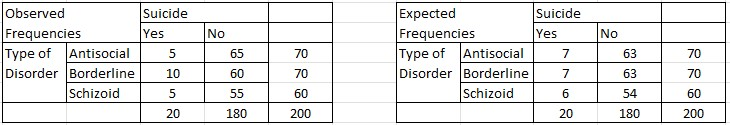

```{r, echo = FALSE, results = "hide"}
include_supplement("vufgb-chisquared-017-nl-table01.jpg", recursive = TRUE)
```

Question
========

The $\chi^{2}$-test for independence is used to examine whether there is an association between type of personality disorder and likelihood of suicide. The first cross tabulation shows the observed frequencies in the sample. The second cross tabulation shows the expected frequencies under the null hypothesis of independence. Calculate the found $\chi^{2}$-value and draw a conclusion. Note: df=2.


  
Answerlist
----------
* $\chi^{2} = 2.96$. $p < .05$ thus a significant relationship.
* $\chi^{2} = 2.96$. $p > .05$ so no significant relationship.
* $p^{2} = 5.99$. $p < .05$ thus a significant relationship.
* $\chi^{2} = 5.99$. $p > .05$ so no significant relationship.

Solution
========

Answerlist
----------
* Incorrect
* Correct
* Incorrect
* Incorrect

Meta-information
================
exname: vufgb-chisquared-017-en
extype: schoice
exsolution: 0100
exsection: Inferential Statistics/NHST/Test statistic/Chi-squared
exextra[Type]: Calculation, Interpreting output, Case
exextra[Program]: 
exextra[Language]: English
exextra[Level]: Statistical Thinking
