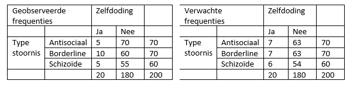

```{r, echo = FALSE, results = "hide"}
include_supplement("vufgb-chisquared-017-nl-table01.jpg", recursive = TRUE)
```

Question
========

De $\chi^{2}$-toets voor onafhankelijkheid wordt gebruikt om te onderzoeken of er een verband is tussen type persoonlijkheidsstoornis en kans op zelfdoding. In de eerste kruistabel staan de geobserveerde frequenties in de steekproef. In de tweede kruistabel staan de verwachte frequenties onder de nulhypothese van onafhankelijkheid. Bereken de gevonden $\chi^{2}$-waarde en trek een conclusie. 
Noot: df=2.


  
Answerlist
----------
* $\chi^{2} = 2.96$. $p < .05$ dus een significant verband.
* $\chi^{2} = 2.96$. $p > .05$ dus geen significant verband.
* $\chi^{2} = 5.99$. $p < .05$ dus een significant verband.
* $\chi^{2} = 5.99$. $p > .05$ dus geen significant verband.

Solution
========

Answerlist
----------
* Incorrect
* Correct
* Incorrect
* Incorrect

Meta-information
================
exname: vufgb-chisquared-017-nl
extype: schoice
exsolution: 0100
exsection: Inferential Statistics/NHST/Test statistic/Chi-squared
exextra[Type]: Calculation, Interpreting output, Case
exextra[Program]: 
exextra[Language]: Dutch
exextra[Level]: Statistical Thinking