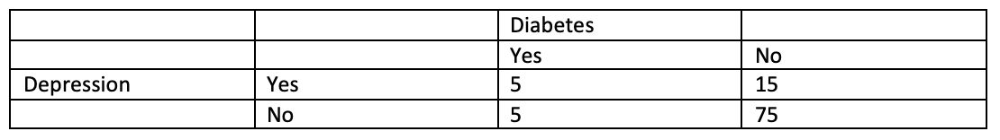

```{r, echo = FALSE, results = "hide"}
include_supplement("vufgb-chisquaredforindependence-002-en-graph-01.png", recursive = TRUE)
```
Question
========
  
Marleen wil met behulp van onderstaande kruistabel met gegevens van 100 ouderen onderzoeken of er een verband is tussen Depressie en Diabetes. Wat is de verwachte frequentie $f_{e}$  in de cel Ja Depressie en Ja Diabetes onder de nulhypothese van onafhankelijkheid?

 
  
Answerlist
----------
* 5.
* 15.
* 1.67.
* 2.

Solution
========

Answerlist
----------
* Onjuist
* Onjuist
* Onjuist
* Juist

Meta-information
================
exname: vufgb-chisquaredforindependence-002-nl
extype: schoice
exsolution: 0001
exsection: Inferential Statistics/Parametric Techniques/Cross tables/Chi-Squared for Independence
exextra[Type]: Calculation
exextra[Language]: Dutch
exextra[Level]: Statistical Thinking
