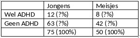

```{r, echo = FALSE, results = "hide"}
include_supplement("vufgb-chisquaredforindependence-004-nl-table01.jpg", recursive = TRUE)
```

Question
========

Given is the cross tabulation below for two categorical variables.

Complete: The conditional distributions are ..., so the variables are ... .



  
Answerlist
----------
* Equal; Independent
* Equal; Independent
* Equal; Dependent
* Equal; Dependent

Solution
========

Answerlist
----------
* Correct
* Incorrect
* Incorrect
* Incorrect

Meta-information
================
exname: vufgb-chisquaredforindependence-004-en
extype: schoice
exsolution: 1000
exsection: Inferential Statistics/Parametric Techniques/Cross tables/Chi-Squared for Independence
exextra[ID]: 9ac43
exextra[Type]: Interpreting output
exextra[Program]: 
exextra[Language]: English
exextra[Level]: Statistical Literacy
