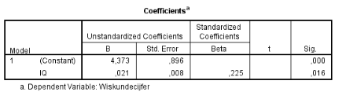

```{r, echo = FALSE, results = "hide"}
include_supplement("vufgb-coefficientttest-002-nl-table01.jpg", recursive = TRUE)
```

Question
========

A regression analysis on the relationship between IQ and mathematics grades achieved on the final exam was conducted using information on 115 first-year students. Part of the output is shown below. Based on this, calculate the t-statistic associated with the estimated regression coefficient for IQ.  


  
Answerlist
----------
* 2.145
* 2.625
* 14.06
* 28.13


Solution
========

Answerlist
----------
* Incorrect
* Correct
* Incorrect
* Incorrect

Meta-information
================
exname: vufgb-coefficientttest-002-en
extype: schoice
exsolution: 0100
exsection: Inferential Statistics/Regression/Coefficient t-test, Descriptive statistics/Data representation/Tables
exextra[Type]: Calculation, Interpreting graphInterpreting graph
exextra[Program]: 
exextra[Language]: English
exextra[Level]: Statistical Thinking
