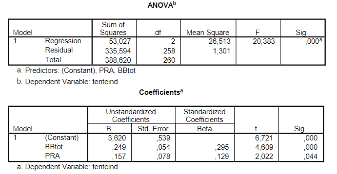

```{r, echo = FALSE, results = "hide"}
include_supplement("vufgb-confidenceinterval-002-nl-table01.jpg", recursive = TRUE)
```

Question
========
  
In the analysis that was conducted on the data of 348 students, three variables were used: grade on blackboard tests (BBtot), grade on practicum (PRA) and grade on exam (tenteind). It was assumed in advance assumed that all grades have a positive relationship with each other.

Determine the 95% confidence interval for the regression coefficient of PRA.


  
Answerlist
----------
* $−0.067 < \beta_{2} < 0.382$
* $−0.024 < \beta_{2} < 0.282$
* $0.079 < \beta_{2} < 0.235$
* $0.004 < \beta_{2} < 0.310$

Solution
========

Answerlist
----------
* Incorrect
* Incorrect
* Incorrect
* Correct

Meta-information
================
exname: vufgb-confidenceinterval-002-en
extype: schoice
exsolution: 0001
exsection: Inferential Statistics/Regression/Confidence interval, Inferential Statistics/Regression/R squared
exextra[Type]: Calculation, Interpreting output
exextra[Program]: 
exextra[Language]: English
exextra[Level]: Statistical Thinking
