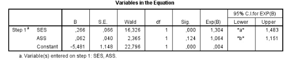

```{r, echo = FALSE, results = "hide"}
include_supplement("vufgb-confidenceinterval-003-nl-table01.jpg", recursive = TRUE)
```

Question
========

A child psychologist is conducting research on the relationship between oppositional defiant behavior disorder (ODD), socioeconomic status (SES) and assertiveness (ASD). The research question is whether the likelihood of developing ODD can be predicted based on scores on the other two variables. To this end, a logical regression is performed. Some of the results are shown below.


  
What applies to the missing values at the confidence intervals for EXP(B) shown by *a* and *b*?  
  
Answerlist
----------
* *a* > 1, *b* < 1
* *a* > 1, *b* > 1
* *a* < 1, *b* < 1
* *a* < 1, *b* > 1

Solution
========

Answerlist
----------
* Correct
* Incorrect
* Incorrect
* Incorrect

Meta-information
================
exname: vufgb-confidenceinterval-003-en
extype: schoice
exsolution: 1000
exsection: Inferential Statistics/Regression/Confidence interval, Inferential Statistics/Regression/Logistic regression
exextra[Type]: Interpreting output
exextra[Program]: 
exextra[Language]: English
exextra[Level]: Statistical Thinking
