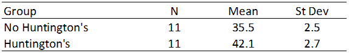

```{r, echo = FALSE, results = "hide"}
include_supplement("vufgb-confidenceintervals-004-en.png", recursive = TRUE)
```

Question
========
We want to investigate whether there is a difference in mood swings between people with and without Huntington’s disease. A random sample of 11 participants is selected from both groups. Then, they are asked to participate in the research. Mood swings are measured on a numerical scale. The results are presented in the table below. Assume equal variances when determining the degrees of freedom for your test statistic. Calculate the 95% confidence interval for the difference in mood swings.  



Answerlist
----------
* (4.59, 8.61) 
* (4.29, 8.91) 
* (4.69, 8.51) 
* (4.13, 9.07)

Meta-information
================
exname: vufgb-confidenceintervals-004-en
extype: schoice
exsolution: 0100
exsection: Inferential Statistics/Confidence Intervals, Inferential Statistics/Sampling Distributions/Difference two means
exextra[Type]: Calculation, Case, Interpretating output
exextra[Language]: English
exextra[Level]: Statistical Thinking