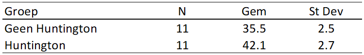

```{r, echo = FALSE, results = "hide"}
include_supplement("vufgb-confidenceintervals-004-nl.png", recursive = TRUE)
```

Question
========
We willen onderzoeken of er een verschil is in stemmingswisselingen tussen personen met en zonder de ziekte van Huntington. We selecteren uit beide groepen een willekeurige steekproef van 11 deelnemers. Zij doen mee aan het onderzoek. Stemmingswisselingen worden gemeten op een numerieke schaal. In de tabel hieronder staan de resultaten. Ga uit van gelijke varianties bij het bepalen van het aantal vrijheidsgraden van de toetsstatistiek. Bereken het 95% betrouwbaarheidsinterval voor het verschil in stemmingswisselingen.



Answerlist
----------
* (4.59, 8.61) 
* (4.29, 8.91) 
* (4.69, 8.51) 
* (4.13, 9.07)

Meta-information
================
exname: vufgb-confidenceinterval-004-nl
extype: schoice
exsolution: 0100
exsection: Inferential Statistics/Confidence Intervals, Inferential Statistics/Sampling Distributions/Difference two means
exextra[Type]: Calculation, Case, Interpretating output
exextra[Language]: Dutch
exextra[Level]: Statistical Thinking