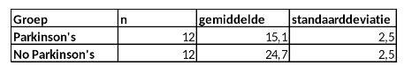

```{r, echo = FALSE, results = "hide"}
include_supplement("vufgb-confidenceintervals-014-nl-table01.jpg", recursive = TRUE)
```

Question
========
  
In een onderzoek naar verschil in geheugen tussen mensen met de ziekte van Parkinson’s en gezonde mensen is uit beide groepen op aselecte wijze een steekproef van 24 personen getrokken. Onderstaand zijn de resultaten van dit onderzoek. Bereken het 95% betrouwbaarheidsinterval voor het verschil in geheugen. 


  
Answerlist
----------
* (7.48 , 11.72) 
* (7.38 , 11.82)
* (7.85 , 11.35)
* (7.78 , 11.42)

Solution
========

Answerlist
----------
* Correct
* Incorrect
* Incorrect
* Incorrect

Meta-information
================
exname: vufgb-confidenceintervals-014-nl
extype: schoice
exsolution: 1000
exsection: Inferential Statistics/Confidence Intervals
exextra[Type]: Calculation
exextra[Program]: 
exextra[Language]: Dutch
exextra[Level]: Statistical Thinking
