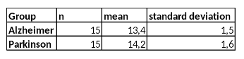

```{r, echo = FALSE, results = "hide"}
include_supplement("vufgb-confidenceintervals-016-en-table01.jpg", recursive = TRUE)
```

Question
========
  
To investigate whether there is a difference in the quality of life between patients with **Alzheimer’s** disease and patients with **Parkinson’s** disease, a random sample of 15 participants is selected from both groups and asked to participate in the research. The results are in the table below. Calculate the 95% confidence interval for the difference in quality of life.  


  
Answerlist
----------
* (-0.20 , 1.80) 
* (-0.16 , 1.76) 
* (-0.41 , 2.01)
* (-0.36 , 1.96)

Solution
========

Answerlist
----------
* Incorrect
* Incorrect
* Incorrect
* Correct

Meta-information
================
exname: vufgb-confidenceintervals-016-en
extype: schoice
exsolution: 0001
exsection: Inferential Statistics/Confidence Intervals
exextra[Type]: Calculation
exextra[Program]: 
exextra[Language]: English
exextra[Level]: Statistical Thinking
