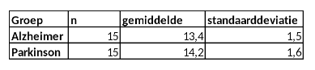

```{r, echo = FALSE, results = "hide"}
include_supplement("vufgb-confidenceintervals-017-nl-table01.jpg", recursive = TRUE)
```

Question
========
  
In een onderzoek naar verschil in kwaliteit van leven tussen patiënten met Alzheimer en patiënten met Parkinson is uit beide groepen op aselecte wijze een steekproef van 15 personen getrokken. Onderstaand zijn de resultaten van dit onderzoek. Bereken het 95% betrouwbaarheidsinterval voor het verschil in kwaliteit van leven.



  
Answerlist
----------
* (-0.20 , 1.80) 
* (-0.16 , 1.76) 
* (-0.41 , 2.01)
* (-0.36 , 1.96)

Solution
========

Answerlist
----------
* Incorrect
* Incorrect
* Incorrect
* Correct

Meta-information
================
exname: vufgb-confidenceintervals-017-nl
extype: schoice
exsolution: 0001
exsection: Inferential Statistics/Confidence Intervals
exextra[ID]: 433fa
exextra[Type]: Calculation
exextra[Program]: 
exextra[Language]: Dutch
exextra[Level]: Statistical Thinking
