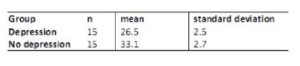

```{r, echo = FALSE, results = "hide"}
include_supplement("vufgb-confidenceintervals-019-en-table01.jpg", recursive = TRUE)
```

Question
========
  
To investigate whether there is a difference in self-regulation between people dealing with and without depression, a random sample of 15 participants is selected from both groups and asked to participate in the research. The results are in the table below. Calculate the 95% confidence interval for the difference in self-regulation.  


  
Answerlist
----------
* (4.65 , 8.55)
* (4.56 , 8.64)
* (4.98 , 8.22) 
* (4.93 , 8.27)

Solution
========

Answerlist
----------
* Correct
* Incorrect
* Incorrect
* Incorrect

Meta-information
================
exname: vufgb-confidenceintervals-019-en
extype: schoice
exsolution: 1000
exsection: Inferential Statistics/Confidence Intervals, Descriptive statistics/Data representation/Tables
exextra[ID]: 22b4a
exextra[Type]: Calculation
exextra[Program]: 
exextra[Language]: English
exextra[Level]: Statistical Thinking
