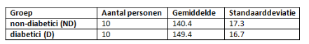

```{r, echo = FALSE, results = "hide"}
include_supplement("vufgb-confidenceintervals-030-nl-table01.jpg", recursive = TRUE)
```

Question
========
  
In een onderzoek naar bloeddrukverschillen tussen diabetici en non-diabetici is uit beide groepen op aselecte wijze een steekproef getrokken. Onderstaand zijn de resultaten van dit onderzoek. Bereken het 95% betrouwbaarheidsinterval van het verschil in bloeddruk.


  
Answerlist
----------
* (-8.20 , 26.2)
* (-6.98 , 25.0)
* (-4.94 , 22.9)
* (-4.19 , 22.2)


Solution
========

Answerlist
----------
* Incorrect
* Correct
* Incorrect
* Incorrect

Meta-information
================
exname: vufgb-confidenceintervals-030-nl
extype: schoice
exsolution: 0100
exsection: Inferential Statistics/Confidence Intervals, Descriptive statistics/Data representation/Tables
exextra[Type]: Calculation
exextra[Program]: 
exextra[Language]: Dutch
exextra[Level]: Statistical Thinking
