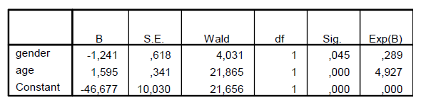

```{r, echo = FALSE, results = "hide"}
include_supplement("vufgb-confidenceintervals-vi-028-nl-table01.jpg", recursive = TRUE)
```

Question
========

A sample consisted of a group of toddlers between 2 and 3 years of age. Showing the first signs of toilet training (`toilet') was predicted based on age (age in months) and gender (dummy for sex, where boy=1).


  
Complete the following statements.

The 95% confidence interval for the odds ratio of gender contains the value 1 ... .

The 95% confidence interval for the odds ratio of age contains the value 1 ... .  
  
Answerlist
----------
* Well, well
* Yes, not
* Not, well
* Not, not

Solution
========

Answerlist
----------
* Incorrect
* Incorrect
* Incorrect
* Correct

Meta-information
================
exname: vufgb-confidenceintervals-xxx-en
extype: schoice
exsolution: 0001
exsection: Inferential Statistics/Confidence Intervals, Descriptive statistics/Summary Statistics/Odds ratio
exextra[Type]: Conceptual
exextra[Program]: 
exextra[Language]: English
exextra[Level]: Statistical Literacy
