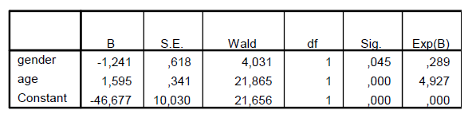

```{r, echo = FALSE, results = "hide"}
include_supplement("vufgb-confidenceintervals-vi-028-nl-table01.jpg", recursive = TRUE)
```

Question
========

Een steekproef bestond uit een groep peuters tussen de 2 en 3 jaar oud. Het vertonen van de eerste tekenen van zindelijkheid (`toilet') werd voorspeld op basis van age (leeftijd in maanden) en gender (dummy voor geslacht, waarbij jongetje=1).


  
Vul de volgende stellingen aan.

Het 95% betrouwbaarheidsinterval voor de odds ratio van gender bevat de waarde 1 ... .

Het 95% betrouwbaarheidsinterval voor de odds ratio van age bevat de waarde 1 ... .  
  
Answerlist
----------
* wel, wel
* wel, niet
* niet, wel
* niet, niet

Solution
========

Answerlist
----------
* Incorrect
* Incorrect
* Incorrect
* Correct

Meta-information
================
exname: vufgb-confidenceintervals-xxx-nl
extype: schoice
exsolution: 0001
exsection: Inferential Statistics/Confidence Intervals, Descriptive statistics/Summary Statistics/Odds ratio
exextra[Type]: Conceptual
exextra[Program]: 
exextra[Language]: Dutch
exextra[Level]: Statistical Literacy
