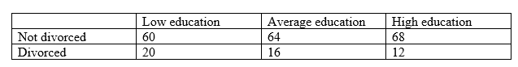

```{r, echo = FALSE, results = "hide"}
include_supplement("vufgb-crosstables-003-en-table01.jpg", recursive = TRUE)
```

Question
========

A scholar is wondering whether there is a relationship between divorce and level of education. He makes the following table based on the collected data in a sample of 240 adults.

Calculate the unstandardized residue for the cell Divorced – Low education.


  
Answerlist
----------
* 4
* 16
* 20
* 40

Solution
========

The unstandardized residual is the difference between the observed frequency in a cell and the expected frequency in a cell, under the null hypothesis (no relationship between two categorical variables) in a cross-table. The observed frequency for the cell Divorced-Low education is 20. The expected frequency (at the null hypothesis) is given by the product of the row and column totals of the cell, divided by the total $N: \; \frac{80 \times 48}{240} = 16$.

The unstandardized residual is: $20-16 = 4$.

Answerlist
----------
* Correct
* Incorrect
* Incorrect
* Incorrect

Meta-information
================
exname: vufgb-crosstables-003-en
extype: schoice
exsolution: 1000
exsection: Inferential Statistics/Parametric Techniques/Cross tables, Inferential Statistics/Regression/Residuals
exextra[Type]: Calculation, Interpreting output
exextra[Program]: 
exextra[Language]: English
exextra[Level]: Statistical Thinking