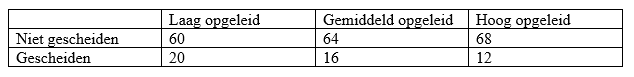

```{r, echo = FALSE, results = "hide"}
include_supplement("vufgb-crosstables-004-nl-table01.jpg", recursive = TRUE)
```

Question
========

A researcher wants to know if there is a relationship between divorce and educational attainment. He creates the cross tabulation below based on data collected in a sample of 240 adults.

Calculate the unstandardized residual for the cell Divorced-Lowly educated.


  
Answerlist
----------
* 4
* 16
* 20
* 40

Solution
========

The unstandardized residual is the difference between the observed frequency in a cell and the expected frequency in a cell under the null hypothesis of no relationship between two categorical variables in a crosstab. The observed frequency for the cell Separated-Low educated is 20. The expected frequency under the null hypothesis is given by the product of the row and column totals of the cell divided by the total $N: \; 80 \times 48 \div 240 = 16$.

The unstandardized residue is then thus $20-16 = 4$.

Answerlist
----------
* Correct
* Incorrect
* Incorrect
* Incorrect

Meta-information
================
exname: vufgb-crosstables-004-en
extype: schoice
exsolution: 1000
exsection: Inferential Statistics/Parametric Techniques/Cross tables, Inferential Statistics/Regression/Residuals
exextra[Type]: Calculation, Interpreting output
exextra[Program]: 
exextra[Language]: English
exextra[Level]: Statistical Thinking
