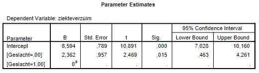

```{r, echo = FALSE, results = "hide"}
include_supplement("vufgb-dummies-003-nl-table01.jpg", recursive = TRUE)
```

Question
========

The table below shows the output of a t-test run as a *General Linear Model* (GLM).


  
The dummy coding for gender was as follows:

- male = 0

- female = 1

What would the parameter values have been if one had reversed the dummy coding, i.e. 'female = 0' and 'male = 1' ? 
Answerlist
----------
* A = 8.594, b = 2.362
* A = 8,594, b = -2,362
* A = 10,956, b = 2,362
* A = 10,956, b = -2,362

Solution
========

Answerlist
----------
* Incorrect
* Incorrect
* Incorrect
* Correct

Meta-information
================
exname: vufgb-dummies-003-en
extype: schoice
exsolution: 0001
exsection: Inferential Statistics/Regression/Dummies, Descriptive statistics/Data representation/Tables
exextra[Type]: Calculation, Interpreting output
exextra[Program]: 
exextra[Language]: English
exextra[Level]: Statistical Thinking
