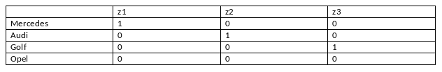

```{r, echo = FALSE, results = "hide"}
include_supplement("vufgb-dummies-006-nl-table01.jpg", recursive = TRUE)
```

Question
========

A market researcher wants to know whether people who drive a Mercedes, Audi, Golf or Opel differ on the y-variable impulsivity. He finds the following regression equation: $\hat{y} = 35+3z_{1}+5z_{2}-2z_{3}$, in which he coded the dummy variables according to the diagram below. Which group of car drivers is the least impulsive? 


  
Answerlist
----------
* Mercedes drivers
* Audi drivers
* Golf drivers
* Opel drivers

Solution
========

Answerlist
----------
* Incorrect
* Incorrect
* Correct
* Incorrect

Meta-information
================
exname: vufgb-dummies-006-en
extype: schoice
exsolution: 0010
exsection: Inferential Statistics/Regression/Dummies, Inferential Statistics/Regression/Dummies
exextra[ID]: 25e10
exextra[Type]: Interpreting output
exextra[Program]: 
exextra[Language]: English
exextra[Level]: Statistical Literacy
