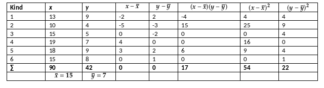

```{r, echo = FALSE, results = "hide"}
include_supplement("vufgb-equation-007-nl-table01.jpg", recursive = TRUE)
```

Question
========

Zes kinderen hebben zichzelf een cijfer gegeven voor hun geluksgevoel (y), en een vragenlijst over kwaliteit van leven ingevuld (x). Bereken met behulp van onderstaande tabel de constante *a* van de regressielijn. 


  
Answerlist
----------
* 2.20
* 2.28
* 4.72
* 12.80

Solution
========

Answerlist
----------
* Incorrect
* Correct
* Incorrect
* Incorrect

Meta-information
================
exname: vufgb-equation-007-nl
extype: schoice
exsolution: 0100
exsection: Inferential Statistics/Regression/Equation, Descriptive statistics/Data representation/Tables
exextra[Type]: Calculation, Interpretating output
exextra[Program]: 
exextra[Language]: Dutch
exextra[Level]: Statistical Thinking