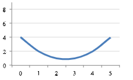

```{r, echo = FALSE, results = "hide"}
include_supplement("vufgb-equation-010-nl-graph01.jpg", recursive = TRUE)
```
```{r, echo = FALSE, results = "hide"}
include_supplement("vufgb-equation-010-nl-graph02.jpg", recursive = TRUE)
```
```{r, echo = FALSE, results = "hide"}
include_supplement("vufgb-equation-010-nl-graph03.jpg", recursive = TRUE)
```
```{r, echo = FALSE, results = "hide"}
include_supplement("vufgb-equation-010-nl-graph04.jpg", recursive = TRUE)
```
Question
========

Welke figuur past bij de kwadratische regressievergelijking $\hat{y} = 4+2.5x_{1}-0.5x_{1}^{2}$?

Figuur A:


Figuur B:


Figuur C:


Figuur D:


Answerlist
----------
* Figuur A
* Figuur B
* Figuur C
* Figuur D


Solution
========

Answerlist
----------
* Incorrect
* Correct
* Incorrect
* Incorrect

Meta-information
================
exname: vufgb-equation-010-nl
extype: schoice
exsolution: 0100
exsection: Inferential Statistics/Regression/Equation, Descriptive statistics/Data representation/Graphs
exextra[Type]: Interpreting graph
exextra[Program]: 
exextra[Language]: Dutch
exextra[Level]: Statistical Thinking
