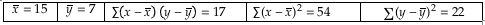

```{r, echo = FALSE, results = "hide"}
include_supplement("vufgb-equation-011-nl-table01.jpg", recursive = TRUE)
```

Question
========
Using the data below, calculate the constant *a* of the estimated regression line describing the relationship between *x* and *y*.


  
Answerlist
----------
* 2.20
* 2.28
* 4.72
* 12.80

Solution
========

Answerlist
----------
* Incorrect
* Correct
* Incorrect
* Incorrect

Meta-information
================
exname: vufgb-equation-011-en
extype: schoice
exsolution: 0100
exsection: Inferential Statistics/Regression/Equation, Descriptive statistics/Data representation/Tables,Inferential Statistics/Regression
exextra[ID]: a7151
exextra[Type]: Calculation, Interpreting output
exextra[Program]: 
exextra[Language]: English
exextra[Level]: Statistical Thinking
