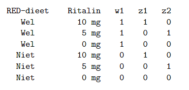

```{r, echo = FALSE, results = "hide"}
include_supplement("vufgb-equation-012-nl-table01.jpg", recursive = TRUE)
```

Question
========

In een onderzoek naar het effect van het Restricted Elimination Dieet en het medicijn Ritalin op het verminderen van ADHD symptomen wordt volgende formule gevonden: $\hat{y} = 30-2w_{1}-1.5z_{1}-0.5z_{2}-2.5w_{1}z_{1}-1.5w_{1}z_{2}$. Hieronder staat de gebruikte codering.



Wat is het verwachte gemiddelde voor kinderen die het RED-dieet en 5 mg Ritalin hebben gekregen?
  
Answerlist
----------
* 26
* 26.5
* 24
* 27.5

Solution
========

Answerlist
----------
* Correct
* Incorrect
* Incorrect
* Incorrect

Meta-information
================
exname: vufgb-equation-012-nl
extype: schoice
exsolution: 1000
exsection: Inferential Statistics/Regression/Equation
exextra[Type]: Interpreting output, Calculation
exextra[Program]: 
exextra[Language]: Dutch
exextra[Level]: Statistical Literacy
