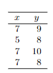

```{r, echo = FALSE, results = "hide"}
include_supplement("vufgb-equation-013-nl-table01.jpg", recursive = TRUE)
```

Question
========

See table below. Determine the regression line of y on x if it is already known that the averages are 6.50 and 8.75, and the correlation between x and y is 0.52.


  
Answerlist
----------
* $\hat{y} = 0.50+5.50x$
* $\hat{y} = 1.73+0.55x$
* $\hat{y} = 0.55+1.73x$
* $\hat{y} = 5.50+0.50x$

Solution
========

Answerlist
----------
* Incorrect
* Incorrect
* Incorrect
* Correct

Meta-information
================
exname: vufgb-equation-013-en
extype: schoice
exsolution: 0001
exsection: Inferential Statistics/Regression/Equation
exextra[ID]: 41641
exextra[Type]: Interpreting output
exextra[Program]: 
exextra[Language]: English
exextra[Level]: Statistical Thinking
